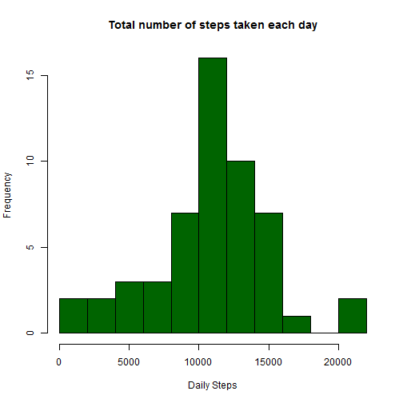
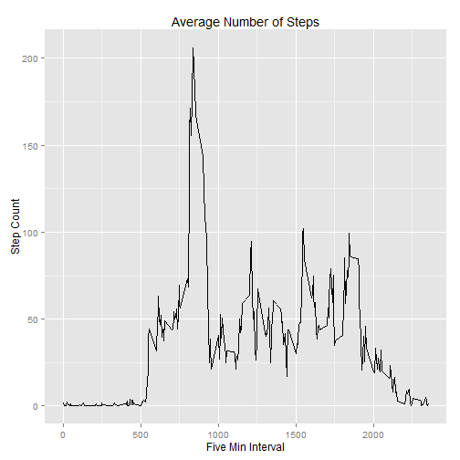
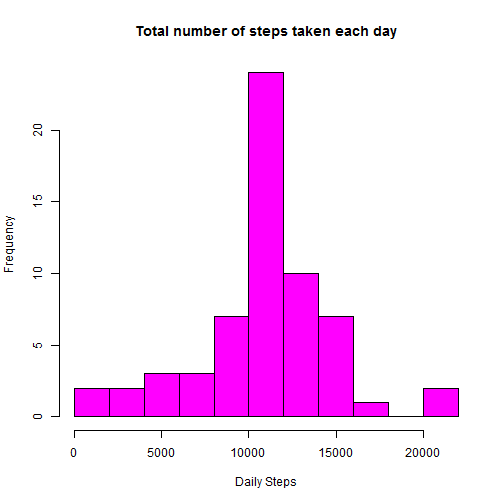
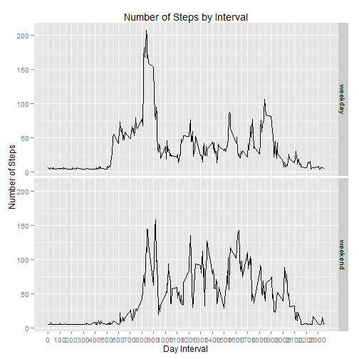

### Assignment 1

This assignment will be described in multiple parts. You will need to write a report that answers the questions detailed below. Ultimately, you will need to complete the entire assignment in a single R markdown document that can be processed by knitr and be transformed into an HTML file.

Throughout your report make sure you always include the code that you used to generate the output you present. When writing code chunks in the R markdown document, always use echo = TRUE so that someone else will be able to read the code. This assignment will be evaluated via peer assessment so it is essential that your peer evaluators be able to review the code for your analysis.

For the plotting aspects of this assignment, feel free to use any plotting system in R (i.e., base, lattice, ggplot2)

Fork/clone the GitHub repository created for this assignment. You will submit this assignment by pushing your completed files into your forked repository on GitHub. The assignment submission will consist of the URL to your GitHub repository and the SHA-1 commit ID for your repository state.


### Reading and transform data


The first step is download the data set from internet, extract the csv file and read data


```r
Dir <- getwd()
Dir
link <- "https://d396qusza40orc.cloudfront.net/repdata%2Fdata%2Factivity.zip"
x <- "Data.zip"
if (!file.exists(Dir)) {dir.create(Dir)}
download.file(link, file.path(Dir, x))
```


```r
if(!file.exists('activity.csv')){
    unzip('Data.zip')
}
Data <- read.csv("activity.csv",header = TRUE, colClasses = c("numeric", "Date", "numeric"))

str(Data)
```

```
## 'data.frame':	17568 obs. of  3 variables:
##  $ steps   : num  NA NA NA NA NA NA NA NA NA NA ...
##  $ date    : Date, format: "2012-10-01" "2012-10-01" ...
##  $ interval: num  0 5 10 15 20 25 30 35 40 45 ...
```


### What is mean total number of steps taken per day?

For this part of the assignment, you can ignore the missing values in the dataset.

        
I interpret "ignore the nulls" like exclude them but not replace them


#### 1-Make a histogram of the total number of steps taken each day


```r
Data.Clean <- na.omit(Data) 
str(Data.Clean)
```

```
## 'data.frame':	15264 obs. of  3 variables:
##  $ steps   : num  0 0 0 0 0 0 0 0 0 0 ...
##  $ date    : Date, format: "2012-10-02" "2012-10-02" ...
##  $ interval: num  0 5 10 15 20 25 30 35 40 45 ...
##  - attr(*, "na.action")=Class 'omit'  Named int [1:2304] 1 2 3 4 5 6 7 8 9 10 ...
##   .. ..- attr(*, "names")= chr [1:2304] "1" "2" "3" "4" ...
```

```r
Steps <- rowsum(Data.Clean$steps, format(Data.Clean$date, '%Y-%m-%d')) 
Steps <- data.frame(Steps) 
names(Steps) <- ("Steps") 
head(Steps)
```

```
##            Steps
## 2012-10-02   126
## 2012-10-03 11352
## 2012-10-04 12116
## 2012-10-05 13294
## 2012-10-06 15420
## 2012-10-07 11015
```

```r
hist(Steps$Steps, main="Total number of steps taken each day", 
     breaks=15,xlab="Daily Steps", col = "darkgreen")
```

 


#### 2- Calculate and report the mean and median total number of steps taken per day


```r
MeanSteps <- mean(Steps$Steps, na.rm = TRUE)
formatC(MeanSteps, big.mark = ",", 
        format = "f", digits = 0)
```

```
## [1] "10,766"
```

```r
MedianSteps <- median(Steps$Steps, na.rm = TRUE)
formatC(MedianSteps, big.mark = ",", 
        format = "f", digits = 0)
```

```
## [1] "10,765"
```

### What is the average daily activity pattern?


#### 1- Make a time series plot (i.e. type = "l") of the 5-minute interval (x-axis) and the average number of steps taken, averaged across all days (y-axis)


I use the library Plyr to create a new data object grouped by Interval
and ggplot2 for plotting


```r
library(plyr)
library(ggplot2)

Interval <- ddply(Data.Clean,~interval, summarise, 
                  mean=mean(steps))


qplot(x=interval, y=mean, data = Interval,  geom = "line",
      xlab="Five Min Interval",
      ylab="Step Count",
      main="Average Number of Steps")
```

 

#### 2-Which 5-minute interval, on average across all the days in the dataset, contains the maximum number of steps?


```r
IntervalMax<- Interval[which.max(Interval$mean), ]
IntervalMax
```

```
##     interval  mean
## 104      835 206.2
```


### Imputing missing values

Note that there are a number of days/intervals where there are missing values (coded as NA). The presence of missing days may introduce bias into some calculations or summaries of the data.

#### 1- Calculate and report the total number of missing values in the dataset (i.e. the total number of rows with NAs)


```r
sum(is.na(Data$steps))
```

```
## [1] 2304
```


#### 2- Devise a strategy for filling in all of the missing values in the dataset. The strategy does not need to be sophisticated. For example, you could use the mean/median for that day, or the mean for that 5-minute interval, etc.

To impute the missing values I going to use the the library Hmisc and the mean function.


```r
library(Hmisc)
Clean.Data <- Data
Clean.Data$steps <- with(Clean.Data, impute(steps, mean))
sum(is.na(Clean.Data$steps))
```

```
## [1] 0
```


#### 3- Create a new dataset that is equal to the original dataset but with the missing data filled in.


```r
head (Data)
```

```
##   steps       date interval
## 1    NA 2012-10-01        0
## 2    NA 2012-10-01        5
## 3    NA 2012-10-01       10
## 4    NA 2012-10-01       15
## 5    NA 2012-10-01       20
## 6    NA 2012-10-01       25
```

```r
head (Clean.Data)
```

```
##   steps       date interval
## 1 37.38 2012-10-01        0
## 2 37.38 2012-10-01        5
## 3 37.38 2012-10-01       10
## 4 37.38 2012-10-01       15
## 5 37.38 2012-10-01       20
## 6 37.38 2012-10-01       25
```


#### 4- Make a histogram of the total number of steps taken each day and Calculate and report the mean and median total number of steps taken per day. 


```r
Steps2 <- rowsum(Clean.Data$steps, 
                 format(Clean.Data$date, '%Y-%m-%d')) 
Steps2 <- data.frame(Steps2) 
names(Steps2) <- ("Steps") 
head(Steps2)
```

```
##            Steps
## 2012-10-01 10766
## 2012-10-02   126
## 2012-10-03 11352
## 2012-10-04 12116
## 2012-10-05 13294
## 2012-10-06 15420
```

```r
hist(Steps2$Steps, main="Total number of steps taken each day", 
     breaks=15,xlab="Daily Steps", col = "magenta")
```

 


```r
MeanSteps2 <- mean(Steps2$Steps, na.rm = TRUE)
formatC(MeanSteps2, big.mark = ",", 
        format = "f", digits = 0)
```

```
## [1] "10,766"
```

```r
MedianSteps2 <- median(Steps2$Steps, na.rm = TRUE)
formatC(MedianSteps2, big.mark = ",", 
        format = "f", digits = 0)
```

```
## [1] "10,766"
```

#### Do these values differ from the estimates from the first part of the assignment? What is the impact of imputing missing data on the estimates of the total daily number of steps?


```r
formatC(MeanSteps, big.mark = ",", 
        format = "f", digits = 0)
```

```
## [1] "10,766"
```

```r
formatC(MeanSteps2, big.mark = ",", 
        format = "f", digits = 0)
```

```
## [1] "10,766"
```

```r
formatC(MedianSteps, big.mark = ",", 
        format = "f", digits = 0)
```

```
## [1] "10,765"
```

```r
formatC(MedianSteps2, big.mark = ",", 
        format = "f", digits = 0)
```

```
## [1] "10,766"
```

Yes, is a little diferent, replace the nulls values has increased the average number of steps.


### Are there differences in activity patterns between weekdays and weekends?

For this part the weekdays() function may be of some help here. Use the dataset with the filled-in missing values for this part.

#### 1- Create a new factor variable in the dataset with two levels - "weekday" and "weekend" indicating whether a given date is a weekday or weekend day.


```r
Clean.Data$Dia <- weekdays(Clean.Data$date)

Clean.Data$Type <- ifelse(Clean.Data$Dia %in% 
                                  c("sábado","domingo"), "weekend", "weekday")
```


#### 2-Make a panel plot containing a time series plot (i.e. type = "l") of the 5-minute interval (x-axis) and the average number of steps taken, averaged across all weekday days or weekend days (y-axis). 


```r
library(plyr)
library(ggplot2)
head(Clean.Data)
```

```
##   steps       date interval   Dia    Type
## 1 37.38 2012-10-01        0 lunes weekday
## 2 37.38 2012-10-01        5 lunes weekday
## 3 37.38 2012-10-01       10 lunes weekday
## 4 37.38 2012-10-01       15 lunes weekday
## 5 37.38 2012-10-01       20 lunes weekday
## 6 37.38 2012-10-01       25 lunes weekday
```

```r
Interval2 <- ddply(Clean.Data,~interval+Type, summarise, mean=mean(steps))
head(Interval2)
```

```
##   interval    Type  mean
## 1        0 weekday 7.007
## 2        0 weekend 4.673
## 3        5 weekday 5.384
## 4        5 weekend 4.673
## 5       10 weekday 5.140
## 6       10 weekend 4.673
```

```r
ggplot(data = Interval2, mapping = aes(x = interval, y = mean)) + 
        geom_line() + facet_grid(Type ~ .) + scale_x_continuous("Day Interval", 
        breaks = seq(min(Interval2$interval), max(Interval2$interval), 100)) + 
        scale_y_continuous("Number of Steps") + ggtitle("Number of Steps by Interval")
```

 

yes, at weekends people have a different routine, for example people tend to wake up later


